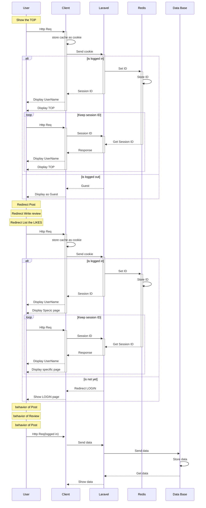

### Redirect process

```mermaid
sequenceDiagram
participant U as User
participant Cl as Client
participant La as Laravel
participant Re as Redis
participant DB as Data Base

    Note over U: Show the TOP
    U ->>+ Cl: Http Req
    Cl ->> Cl: store cache as cookie
    Cl ->>+ La: Send cookie
    
    alt is logged in
        La ->>+ Re: Set ID
        Re ->> Re: Store ID
        La -->>- Cl: Session ID
        Cl -->> U: Display UserName
        Cl -->>- U: Display TOP
        
        loop Keep session ID
            U ->>+ Cl: Http Req
            Cl ->>+ La: Session ID
            Re -->>- La: Get Session ID
            La -->>- Cl: Response
            Cl -->> U: Display UserName
            Cl -->>- U: Display TOP
        end

    else is logged out
        La -->> Cl: Guest
        Cl -->> U: Display as Guest
    end

    Note over U: Redirect Post
    Note over U: Redirect Write review
    Note over U: Redirect List the LIKES
    U ->>+ Cl: Http Req
    Cl ->> Cl: store cache as cookie
    Cl ->>+ La: Send cookie
    
    alt is logged in
        
        La ->>+ Re: Set ID
        Re ->> Re: Store ID
        La -->>- Cl: Session ID
        Cl -->> U: Display UserName
        Cl -->>- U: Display Specic page
        
        loop Keep session ID
            U ->>+ Cl: Http Req
            Cl ->>+ La: Session ID
            Re -->>- La: Get Session ID
            La -->>- Cl: Response
            Cl -->> U: Display UserName
            Cl -->>- U: Display specific page
        end
    
    else is not yet
        La -->> Cl: Redirect LOGIN
        Cl -->> U: Show LOGIN page
    
    end
    Note over U: behavior of Post
    Note over U: behavior of Review
    Note over U: behavior of Post
    U ->>+ Cl: Http Req(logged in)
    Cl ->> La: Send data
    La ->>DB: Send data
    DB ->> DB: Store data
    DB -->> La: Get data
    La -->>Cl: Show data

```
### 