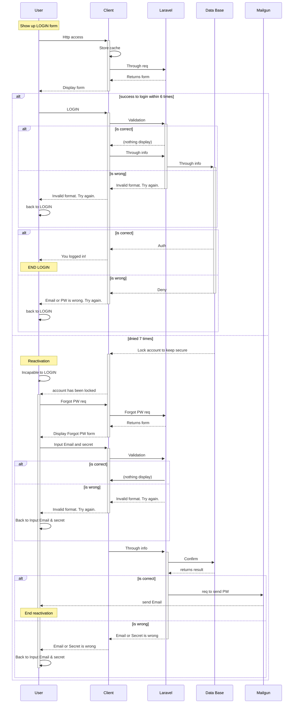

# Jetmeshi
料理は面倒…、外食は高い…、でも栄養は摂りたい…、そんな需要を満たす最速フードを集めたサイトです。
みんなのアイデアを共有しましょう！
Cooking is a hassle...eating out is expensive...but I want to get nutrition...this is a site that collects the fastest food to meet such a demand.
Let's share everyone's ideas!

### Back borns
+ Language: PHP, JavaScript, SCSS, HTML
+ Framework: Laravel v7.7, Bootstrap
+ Tool: Circle CI, Docker, Adobe XD(wire frame), mermaid.js (sequence), Mailgun, Cloudflare
+ Infrastructure: AWS_lightsail, S3

### Login process

### 

