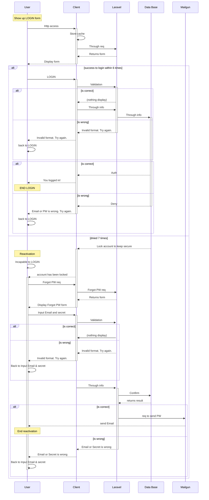
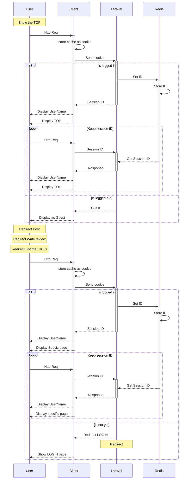

# Sequence

## Login process

```mermaid
sequenceDiagram
participant U as User
participant Cl as Client
participant La as Laravel
participant DB as Data Base
participant Ml as Mailgun
    Note over U: Show up LOGIN form
    U ->>+ Cl: Http access
    Cl ->> Cl: Store cache
    Cl ->> La: Through req
    La -->> Cl: Returns form
    Cl -->>- U: Display form

alt success to login within 6 times
    U ->>+ Cl: LOGIN
    Cl ->>+ La: Validation
    alt is correct
        La-->>Cl: (nothing display)
        Cl ->> La: Through info
        La ->>+ DB: Through info
    else is wrong
        La-->>-Cl: Invalid format. Try again.
        Cl-->>U: Invalid format. Try again.
        U ->> U: back to LOGIN
    end

    alt is correct
        DB -->> Cl: Auth
        Cl-->> U: You logged in!
        Note over U: END LOGIN
    else is wrong
        DB -->>- Cl: Deny
        Cl-->>-U: Email or PW is wrong. Try again.
        U->>U: back to LOGIN
    end


else dnied 7 times
    DB -->>+ Cl: Lock account to keep secure
        Note over U: Reactivation
    U -x U: Incapable to LOGIN
    Cl -->>+ U: account has been locked
    U ->> Cl: Forgot PW req
    Cl ->> La: Forgot PW req
    La -->> Cl : Returns form
    Cl -->>- U: Display Forgot PW form

    U ->>+ Cl: Input Email and secret
    Cl ->>+ La: Validation
    alt is correct
        La ->> Cl: (nothing display)


    else is wrong
        La -->> Cl: Invalid format. Try again.
        Cl -->>- U: Invalid format. Try again.
        U ->> U: Back to Input Email & secret
    end

    Cl ->>+ La: Through info
    La ->> DB: Confirm
    DB -->> La: returns result

    alt is correct
        La ->> Ml: req to send PW
        Ml -->> U: send Email
        Note over U: End reactivation
    else is wrong
        La -->>- Cl : Email or Secret is wrong
        Cl -->> U: Email or Secret is wrong
        U ->>- U: Back to Input Email & secret

        end
end
```

## Redirect process

```mermaid
sequenceDiagram
participant U as User
participant Cl as Client
participant La as Laravel
participant Re as Redis


    Note over U: Show the TOP
    U ->>+ Cl: Http Req
    Cl ->> Cl: store cache as cookie
    Cl ->>+ La: Send cookie

    alt is logged in
        La ->>+ Re: Set ID
        Re ->> Re: Store ID
        La -->>- Cl: Session ID
        Cl -->> U: Display UserName
        Cl -->>- U: Display TOP

        loop Keep session ID
            U ->>+ Cl: Http Req
            Cl ->>+ La: Session ID
            Re -->>- La: Get Session ID
            La -->>- Cl: Response
            Cl -->> U: Display UserName
            Cl -->>- U: Display TOP
        end

    else is logged out
        La -->> Cl: Guest
        Cl -->> U: Display as Guest
    end

    Note over U: Redirect Post
    Note over U: Redirect Write review
    Note over U: Redirect List the LIKES
    U ->>+ Cl: Http Req
    Cl ->> Cl: store cache as cookie
    Cl ->>+ La: Send cookie

    alt is logged in

        La ->>+ Re: Set ID
        Re ->> Re: Store ID
        La -->>- Cl: Session ID
        Cl -->> U: Display UserName
        Cl -->>- U: Display Specic page

        loop Keep session ID
            U ->>+ Cl: Http Req
            Cl ->>+ La: Session ID
            Re -->>- La: Get Session ID
            La -->>- Cl: Response
            Cl -->> U: Display UserName
            Cl -->>- U: Display specific page
        end

    else is not yet
        La -->> Cl: Redirect LOGIN
        Note over La: Redirect
        Cl -->> U: Show LOGIN page

    end

```

## Behavior of User's Action

```mermaid

sequenceDiagram
participant U as User
participant Cl as Client
participant La as Laravel
participant DB as Data Base

    Note over U: Post & Edit

    U ->> Cl: Send JPEG/PNG(logged in)
    Cl ->>+ La: Send photos up to5
    Note over La: Validation
    alt is over 600*315px

        La -->>- Cl: Show preview on sumnails
        U ->>+ Cl: edit or delete
        Cl ->> La: Send data
        Note over La: Triming window
        La -->> Cl: show preview for editing
        Cl -->>- U: show preview for editing

        U ->>+ Cl : req Post
        Cl ->>- La : req Post
        La ->>+ DB: Send data
        Note over DB: showing apllied size
        DB ->> DB: Store for sumnail
        DB ->> DB: Store for WEB
        DB ->> DB: Store for Mobile
        DB ->> S3: Store images
        Note Over S3: Contents Server
        U ->> Cl: Req show the post
        Cl ->>+ La: Req show the post
        DB -->>- La: Get data
        La -->>- Cl: Show the post

    else Nothing is selected
        La -->> Cl: Validate fail
        Cl -->> U: Slect at least 1 image
        Cl -->> U: Must fill in Title
    else is under 600*315px
        La -->> Cl: Validate fail
        Cl -->> U: Should be over 600*315px

    else is invalid format
    La -->> Cl: Validate fail
    Cl -->> U: Should be PNG or JPEG

    else is over 2MB FOR EACH
    La -->> Cl: Validate fail
    Cl -->> U: Should be less than 2MB
    end

    Note over U: Delete Post
    U ->> Cl: Req to delete posts
    La --> Cl: confirm
    Cl -->> U: show alert
    alt Delete
        U ->>+ Cl: Push delete
        Cl ->> La: Req to delete
        La -->> Cl: Show popup
        Cl -->> U: req to push OK
        U ->>Cl: OK
        La ->> DB: Req delete
        La ->> S3: Req Delete
        S3 ->>S3: Delete Image
        DB ->> DB: Flag false
        La -->> Cl: Coplete to delete
        Cl -->> U : Complete to delete
        U ->> Cl: send ok
        Cl ->> La: req to prevoius
        La -->>Cl: Redirect to previous
        Cl -->>-U: Back to Previous

    else Cancel
        U ->> Cl: Cancel
        Cl -->>U: Back to Previous

    end


   Note over U: behavior of Review
    U ->>+ Cl: Req review window
    Cl ->> La: Req reviw Window
    La -->>Cl: Show window
    Cl -->> U: Req title & comment
    U ->> U: Abandon
    U ->> Cl: req Post comment
    Cl ->> La: req Post Comment
    Note over La: Validation
    alt title shorter than 40 & comment shorter than 140
        La ->>+ DB: Store it
        DB ->> DB: Store sum of score on creator
        DB ->>- DB: Store rate of evaluation
    else Too long

        La -->> Cl:be shorter than 40 & 140
        Cl -->> U:be shorter than 40 & 140
    else No title
        La -->> Cl: Place title please
        Cl -->> U:Place title please
    else No Stars
        La -->> Cl: Evaluate please
        Cl -->>- U: Evaluate please

    end

   Note over U: behavior of LIKE

    Note over La: Validation
    alt if not exist
    Cl -->> U: turns heart always gray
    U ->>+ Cl: Push heart
    Cl ->>+ La: Send LIKE
    La ->>+ DB: Store it
    DB ->> DB: Store LIKE List for User
    DB ->> DB: Store number of LIKES on Recipe
    DB -->> La: Show on User's LIKE LIST
    DB -->>- La: Show on number of LIKES on Recipe
    La -->>Cl: Show pink heart
    Cl -->>- U: Show pink heart

    else if exist on "likes table"
    Cl -->> U: turns heart always pink
    U ->>+ Cl: Push heart
    Cl ->> La: Send Unlike
    La ->>+ DB: Store it
    DB ->> DB: Eliminate List for User
    DB ->> DB: Eliminate number of LIKES on Recipe
    DB ->> DB: Eliminate number of LIKES on Creator

    DB -->> La: Remove from User's LIKE LIST
    DB -->>- La: Show on number of LIKES on Recipe
    La -->>Cl: Show gray heart
    Cl -->>- U: Show gray heart

    end

    Note over U: behavior of Search Recipe
    U ->>+ Cl: Set conditions
    Cl ->> La: Send
    La ->>+ DB: Serach it lim. 10
    DB ->> DB: Type, Time, Cost, Tags
    DB ->> DB: KEYWORD Elastic search

    DB -->>- La: Show results lists
    La -->>Cl: Show 10 results
    Note over La: Pagenations
    Cl -->>- U: Show 10 results
    loop if there are more results
        U ->>+ Cl: Scroll down
        Cl ->> La: Req
        La ->> DB: Req
        DB -->> La: Show results lists
    La -->>Cl: Show 10 results
    Cl -->>- U: Show 10 results
    end

    Note over U: Create account
    U ->> Cl: Put info
    Cl ->>+ La: Req validation
    Note over La: Validation
    alt is valid
    La ->> DB: send info

    else invalid e-mail format
    La -->> Cl: invalid email format

    else invalid PW
    La -->> Cl: must Include char and number
    La -->>- Cl: must be longer than 6

    end

    U ->> Cl: Creat with Twitter
    U ->> Cl: Create with Google
    U ->> Cl: Creat with LINE
    Cl ->>+ La: Req
    alt is valid
    La ->> La: Redirect to service
    La ->> DB: store E-mails
    La ->> Cl: Redirect WELCOME page


    else does not exist
    La -->> Cl: does not exist

    end

    Note over U: Edit profile photo

    U ->> Cl: Req changing photo
    Cl ->>+ La: Req to change
    Note over La: Validation
    alt is over 200*200px

        La -->>- Cl: Show preview on sumnails
        U ->>+ Cl: edit
        Cl ->> La: Send data
        Note over La: Triming window
        La -->> Cl: show preview for editing
        Cl -->>- U: show preview for editing

        U ->>+ Cl : req Post
        Cl ->>- La : req Post
        La ->>+ DB: Send data
        Note over DB: showing apllied size
        DB ->> DB: Store for sumnail
        DB ->> DB: Store for WEB
        DB ->> DB: Store for Mobile
        DB ->> S3: Store images
        Note Over S3: Contents Server
        U ->> Cl: Req show the post
        Cl ->>+ La: Req show the post
        DB -->>- La: Get data
        La -->>- Cl: Show the post

    else Nothing is selected
        La -->> Cl: Validate fail
        Cl -->> U: Slect at least 1 image
    else is under 200*200px
        La -->> Cl: Validate fail
        Cl -->> U: Should be over 200*200px

    else is invalid format
    La -->> Cl: Validate fail
    Cl -->> U: Should be PNG or JPEG

    else is over 2MB FOR EACH
    La -->> Cl: Validate fail
    Cl -->> U: Should be less than 2MB
    end

Note over U: Edit profile sentence

    U ->>+ Cl: Req Edit
    Cl ->> La: Req to change
        Note over La: Overlay window
        La -->> Cl: Show window
        U ->> Cl: edit
        Cl ->> La: Send data
    alt is valid
        La ->> DB: Send data
        Note over DB: showing apllied size
        DB ->> DB: Store for sumnail
        DB ->> DB: Store for WEB
        DB ->> DB: Store for Mobile
        DB ->> S3: Store images
        Note Over S3: Contents Server
        U ->> Cl: Req show the post
        Cl ->> La: Req show the post
        DB -->> La: Get data
        La -->> Cl: Show the post

    else over 400 words
        La -->> Cl: Validate fail
        Cl -->> U: less than 400 words

    else is invalid format
    La -->> Cl: Validate fail
    Cl -->> U: Not allow to use special char
    end

```
